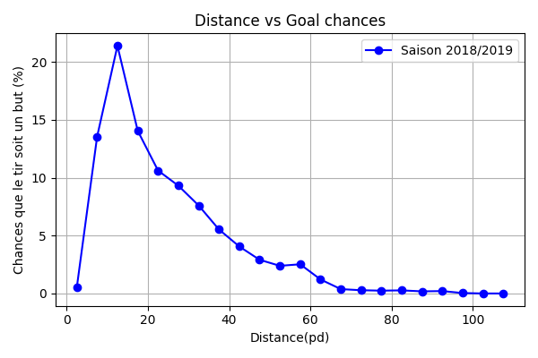
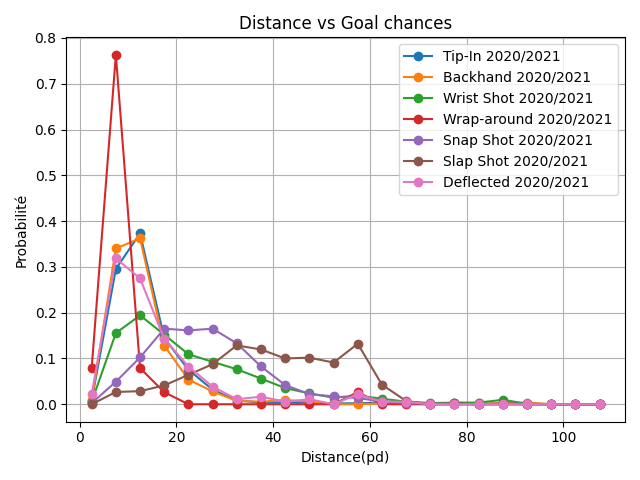

## Résumé

La première partie de ce projet incluait principalement l'acquisition, le nettoyage, l'exploration ainsi que la visualisation des données. Les sections suivantes détaillent ce qui a été fait pour chacune de ces étapes.

## Acquisition des données

### Téléchargement des données play-by-play

Pour télécharger les données brutes *play-by-play*, il suffit de:

1. Naviguer au répertoire `notebooks/full_pipeline.ipynb`
2. Lancer les balises sous la section 0 (Imports) et la section 1 (Collecting Data)

Alternativement, vous pouvez:

1. Naviguer au répertoire `scripts/`
2. Lancer le fichier `data_acquisition.py` dans un environnement ayant un interpréteur python 3.9 ou supérieur d'installé (au besoin, consulter la section [Configuration du projet]({{site.baseurl}}))

Ce bout de code est responsable de se connecter à l'API de la NLH et d'aller chercher toutes les données des saisons 2016-2017 à 2020-2021 (inclusivement) et les sauvegarder dans le répertoire `data/raw` en tant que fichier JSON.

Ce pipeline de collecte de données nous permet d'accéder aux informations spécifiques d'un match via un identifiant unique, *game_id*, intégré à l'URL correspondante à cet id.

## Outil de débogage interactif

L'outil de débogage interactif permet de visualer les évènement (données *play-by-play*) des matchs répertoriés par saison. Le notebook permet de rouler cet outil se trouve dans le répertoire du projet `/notebooks/interactif_debugger.ipynb`.

La saison et le type de la saison (régulière vs éliminatoire) peuvent être sélectionnés via les menus déroulant. Pour les saisons régulières (`season_type = regular`), un *slider* (**gameId**) est intégré pour choisir l'index du match à visualiser (figure de gauche). Pour les saisons éliminatoires (`season_type = playoff`), trois *sliders* sont intégrés (figure de droite): 
- **round**: permet de choisir le numéro de la ronde éliminatoire (entre 1 et 4)
- **rencontre**: permet de choisir le numéro de rencontre (varie entre 1 et 8 selon la ronde choisie)
- **match**: permet de choisir le numéro de match (entre 1 et 7). Si une rencontre se termine en moins de 7 matchs, du texte est imprimé à la place des coordonnées sur la patinoire.


À partir des valeurs choisies, si l'évènement sélectionné possède des coordonnées, celles-ci seront montrées sur la patinoire à l'aide d'un cercle bleu. Si l'évènement ne possède pas de coordonnées, aucun cercle bleu ne sera montré. Les informations concernant l'évènement en question sont imprimées en-dessous de la patinoire.


## Nettoyer les données

### Question 1

Le script de nettoyage de données (`scripts/Dataframe.py`) nous permet d'obtenir un dataframe contenant les informations pertinentes sur les tirs au but pour tous les matchs de toutes les saisons. Les 10 premières lignes de ce dataframe peuvent être observées ci-bas:


### Question 2

Il serait en effet important d'inférer le nombre exact de joueur sur la glace et d'inclure cette statistique dans d'autres évènements comme les tirs. Pour ce faire, on pourrait constamment déduire le nombre de joueurs actifs en regardant les différents évènements passés. Par exemple, s'il y a une pénalité, alors on sait que l'équipe est rendu à 4 joueurs sur la glace. Ou encore, si on est en overtime en saison régulière, on sait qu'on est 3 contre 3 et en powerplay 4 contre 3. En conservant constamment le nombre de joueurs sur la glace, on va pouvoir remplir le champ pour tous les différents évènements et on va pouvoir faire la distinction entre les différents types de powerplay. Ces informations pourront ultimement contribuer à améliorer la performance de notre modèle pour prédire si un but a été marqué ou non suite à un tir.

### Question 3

Il serait possible à partir de ces données de créer les caractéristiques supplémentaires suivantes:

**Angle de tir**: il serait intéressant de prendre en compte l'angle de tir (i.e. l'angle entre les coordonnés du tir et le centre de la glace) dans notre modèle de prédiction. En effet, on pourrait s'attendre à ce que la probabilité de marquer un but diminue si l'angle de tir augmente. Considérant que les coordonnées du centre du filet sont (89, 0) pour le filet de droite et (-89, 0) pour le filet de gauche, il est possible de calculer l'angle de tir (les valeurs des coordonnées proviennent de [hockeyanalytics.com](http://hockeyanalytics.com/Research_files/SQ-RS0910-Krzywicki.pdf)). Considérant (x, y) comme coordonnées du tir, l'angle de tir (*theta*, en radian) se défini comme suit:

```
theta = arctan(|y|/89-|x|) 
```

**Rebond**: intégrer en caractéristique si un tir provient d'un rebond ou non pourrait contribuer à la prédiction d'un but. En effet, les [rebonds](https://en.wikipedia.org/wiki/Rebound_(sports)#) procurent une opportunité supplémentaire de marquer. Il est raisonable de penser que le décours temporel entre un tir menant à un rebond de la rondelle et un tir effectué sur ce rebond est assez court. On pourrait donc considérer le délai entre des tirs consécutifs en fonction d'un seuil fixé. Par exemple, on pourrait mettre un seuil (`seuil_rebond`) de 2 secondes et considérer `time_2` - `time_1` <= 2 comme un rebond, avec `time_1` défini comme le temps où s'est produit le premier tir et `time_2`, le temps où s'est produit le deuxième tir. Si cette différence est supérieure à `seuil_rebond`, le deuxième tir n'est pas considéré comme un rebond.

**Expérience de jeu de l'attaquant vs gardien de but**: l'expérience de jeu de
l'attaquant comparativement au niveau du gardien de but peut également contribuer à la
probabilité de marquer un but. On peut poser l'hypothèse qu'un attaquant expérimenté
qui tir sur un nouveau gardien de but a une plus grande probabilité de marquer que
lorsqu'un nouvel attanquant tir sur un gardien de but expérimenté. Pour chaque
évènement de type tir, on a accès au nom de l'attaquant et au nom du gardien. À partir
de ces informations on peut retrouver dans les données brutes les informations sur
chaque joueur, notamment s'ils sont *rookie* ou non. Nous pourrions calculer une variable *relative_experience* qui aurait comme valeur 'neutral' si `rookie_attacker==rookie_goaler`, 'high' si `rookie_attacker==False & rookie_goaler==True`, et 'low' si `rookie_attacker==True & rookie_goaler==False`. Il est tout de même à noter que cette caractéristique est limitée puisqu'elle considérerait équivalente un joueur avec 2 ans d'expérience dans la LNH vs un joueur avec 10 ans d'expérience.


## Visualisations simples

### Question 1

Le tir *tip-in* semble être le plus effectif pour marquer un but. Le tir du poignet (*wrist shot*) est le plus courant. 

[AJOUTER GRAPH]

### Question 2

Les chances de marquer augmente de manière presque linéaire jusqu'à environ 15 pieds. Lorsque la distance dépasse 15 pieds, les chances de marquer diminue de manière exponentielle. Le type de graphique choisi (i.e. *line plot*), permet de bien visualiser la relation entre la distance au but et les chances que le tir soit un but. Il nous permet de voir que cette relation semble assez stable entre les saisons, du moins entre 2018-2019 et 2020-2021.




### Question 3

Si l'on considère maintenant la relation entre les chances de marquer et la distance en fonction du type de tir, on peut observer que la distance optimale pour les tirs de type *tip-in*, *deflected*, *backhand* et *wrist shot* semble être entre 10 et 15 pieds. Les tirs *wrap-around* semblent n'être qu'efficace lorsque la distance est d'environ 10 pieds. Lorsque la distance dépasse 20 pieds, les *slap shot* et les *snap shot* seraient plus dangereux. Après 40 pieds, le slap shot semble être la meilleure option de tir pour espérer marquer un but.



## Visualisations avancées

### Question 1

### Question 2

### Question 3

### Question 4
