## Résumé

La deuxième partie de ce projet s'est concentrée sur l'ingénierie des caractéristiques (*feature engineering*) et le développement de modèles permettant de prédire les buts espérés (*expected Goals*; xG).

## Aperçu des données`

Cette section fournie une description des données qui ont été utilisés dans cette étape du projet.

Les données utilisées proviennent de l'API de la LNH. Les données jeu-par-jeu (*play-by-play*) des saisons 2016-2017 à 2020-2021 inclusivement. Plus précisément, les données des saisons régulières de 2016-2017 jusqu'à 2019-2020 inclusivement ont été utilisées pour entraîner et valider les modèles développés. Toutes les données de la saison 2020-2021 ont été utilisées pour tester les modèles.

## Ingénérie des caractéristiques I

Les figures de la section ci-dessous peuvent être générées en roulant les cellules de la section Milestone 2 dans le notebook [visualisation.ipynb](https://github.com/mathieupelo/ift6758-A08/blob/main/notebooks/visualisation.ipynb). Cette section explore le nombre de tirs (buts vs non-buts) en fonction de la distance et l'angle entre le tireur et le filet. Pour calculer ces variables, nous avons pris en compte le point milieu du filet, soit les coordonnées absolues (89, 0).

La distance euclédienne entre le tir et le filet a été calculée de la manière suivante:
```
distance = np.sqrt((x_filet - np.abs(x_tir))**2 + (y_filet - np.abs(y_tir))**2)
```

L'angle entre le tir et le filet a été calculé comme suit:
```
angle = np.arctan((y_filet - y_tir)/(x_filet - np.abs(x_tir)))
```
Puis converti en degré:
```
angle = np.rad2deg(angle)
```

Les calculs de l'angle et de la distance ont été implémentés dans le script feature_engineering.py avec la librairie [numpy](https://numpy.org/doc/stable/).

### Question 1

Visuellement, nous pouvons observer que le nombre de tirs selon la distance ne semble pas être distribué normalement, autant pour les buts que les non-buts (voir Figure ci-dessous; gauche: données non-transformées, droite: données log transformées). En effet, la majorité des tirs (buts et non-buts) sont effectués à environ 10 pieds du filet. Au-delà de 10 pieds, le nombre de non-buts diminue et reste relativement stable entre 20 et 60 pieds pour diminuer de manière drastique au-delà de 60 pieds du filet. Le nombre de buts semble diminué de manière constante entre 20 et 60 pieds. au-delà de 60 pieds, le nombre de buts semble suivre la même tendance que le nombre de non-buts. Nous pouvons également conclure qu'il y a beaucoup moins de buts que de non-buts.

<p align="center">
      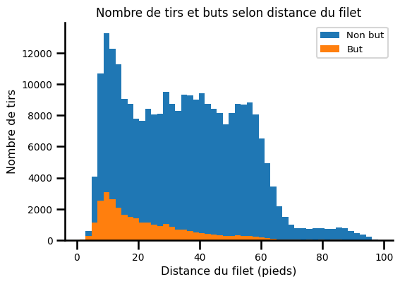
      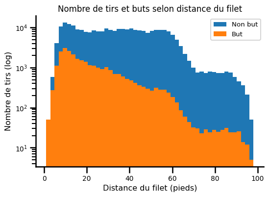
</p>

Le nombre de tirs selon l'angle n'est pas distribué normalement, autant pour les buts que les non-buts. Nous pouvons observer que la distribution des non-buts semble être tri-modale, avec un pic à environ -30 degrés, un pic à 0 degré et un pic à environ 30 degré. La distribution de part et d'autres du zéro semble assez symétrique, ce qui suggère que nous pourrions considérer la valeur absolue des angles. En d'autres mots, que le tireur soit à gauche ou à droite du gradien ne semble pas avoir d'incidence sur le nombre de tirs ainsi que sur le nombre de buts. La distribution des buts ressemble un peu plus à une distribution normale, bien qu'il y a une prévalence qu'il y a un nombre de buts plus important lorsque l'angle entre le tireur et le filet est proche de 0.

<p align="center">
      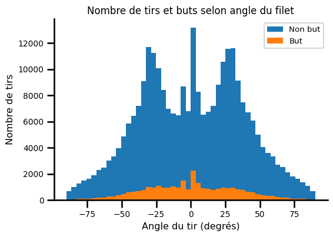
      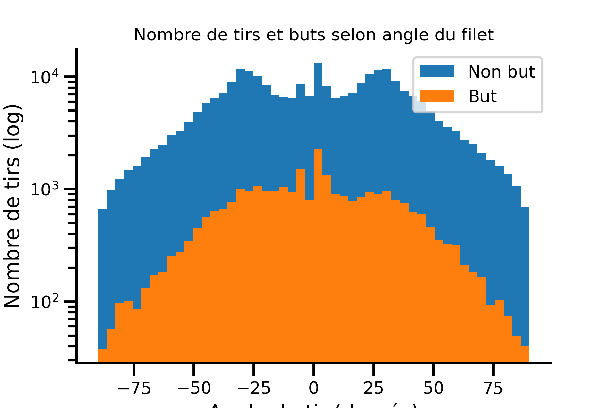
</p>

Nous pouvons tirer les mêmes conclusions globales que précédemment en regardant l'histogramme 2D ci-dessous. Par contre, il est à noter que les tirs ne sont pas séparés en buts et  non-buts dans cette figure. L'histogramme 2D nous permet également de voir qu'à plus de 40 pieds du filet, l'angle de tir décroit de manière exponentielle jusqu'à environ 25 degrés. 

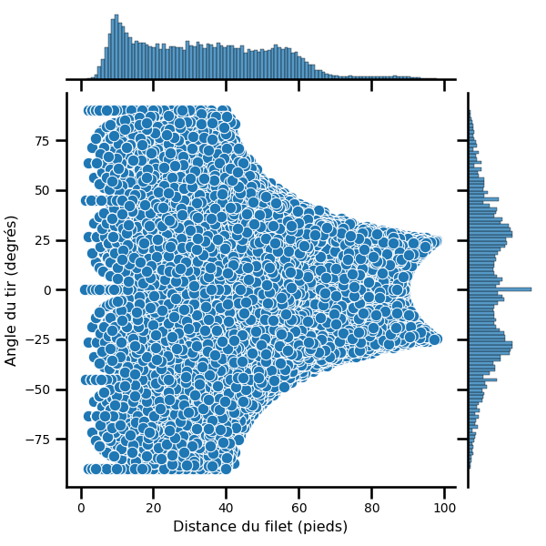


### Question 2

Le taux de buts décroit à mesure que la distance augmente entre le tir et le filet augmenter (Figure de gauche). Ce taux est plus grand lorsque l'angle entre le tir et le filet est environ entre 5 et 10 degrés. Par la suite, le taux de buts diminue plus l'angle augmente.

<p align="center">
    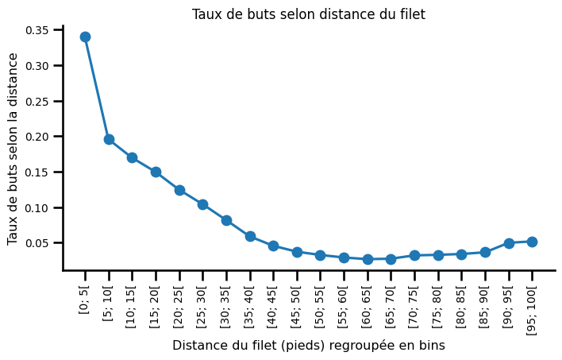
    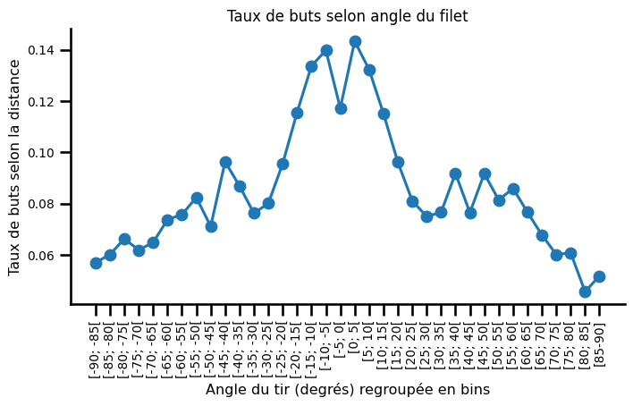
</p>

### Question 3

Nous pouvons observer qu'il y a un plus grand nombre de buts marqués aux alentours de 10 pieds lorsque le filet n'est pas vide. Lorsque la distance entre le tir et le filet dépasse les 10 pieds, le nombre de buts marqués diminue presque exponentiellement en fonction de la distance. Lorsque le filet est vide, le nombre de buts ne semble pas dépendre de la distance entre le tir et le filet.

<p align="center">
      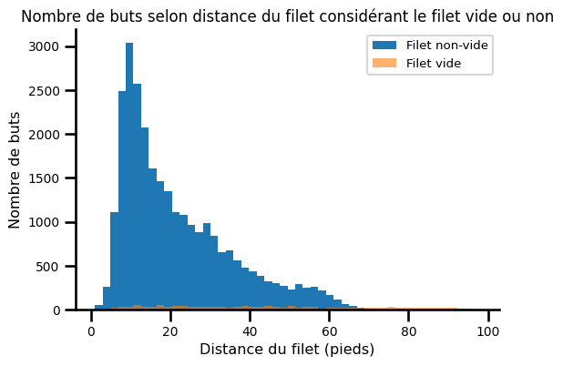
      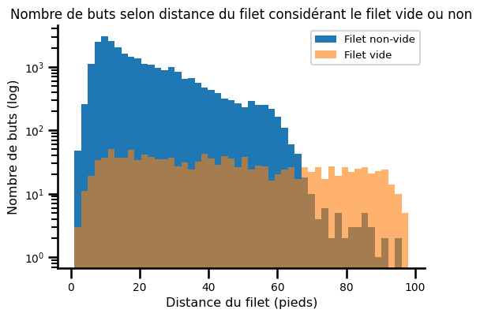
</p>


## Modèles de base

Le premier modèle demandé se base sur la distance entre le tir et le filet pour prédire les buts espérés. Il a été entraîné sur 80% des données et la précision (*accuracy*) a été calculée sur le 20% des données restantes. Nous avons obtenu une précision de 90.62 %. La métrique de précision (*accuracy*) ne tient malheureusement pas compte des prédictions faites par classe, uniquement des prédictions sur l'ensemble des classes. Ceci pose un problème lorsque nous avons des classes débalancées. En effet, si l'on regarde la proportion de chaque classe dans nos données, nous pouvons observer que 90.62% de nos observations appartiennent à la classe 0 (i.e., non-but). En regardant la matrice de confusion, nous pouvons bel et bien voir que ce modèle prédit systématiquement la classe majoritaire.
```
[[55426     0]
[ 5734      0]]

où les lignes correspondes aux vrais classes (0, 1) et les colonnes correspondes aux classes prédites (0,1)
Nombre de vrais négatifs = 55426, nombre de faux négatifs = 5734, nombre de vrais négatifs = 0, nombre de faux négatifs = 0.
```
Ces observations montrent qu'il est donc important de considérer des métriques différentes pour évaluer de manière adéquate nos modèles. Pour les sections suivantes, nous avons donc intégrer la métrique *Area Under the Curve (AUC)* calculée sur les courbes *Receiver Operating Characteristic (ROC)* évalué sur le modèle précédent. Deux nouveaux modèles de régression logistique ont été entraînées. Un incluant uniquement l'angle entre le tir et le filet pour prédire les buts espérés, et  l'autre incluant la distance et l'angle entre le tir et le filter pour réaliser cette prédiction. Ces modèles ont été entraînés sur 80% des données d'entraînement et évaluer sur les 20% restants.

<p align="center">
      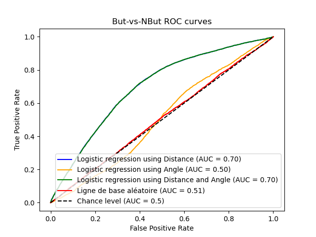
      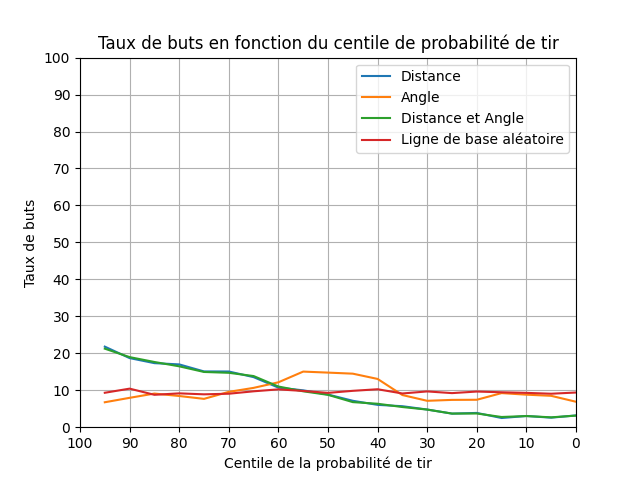
</p>
<p align="center">
      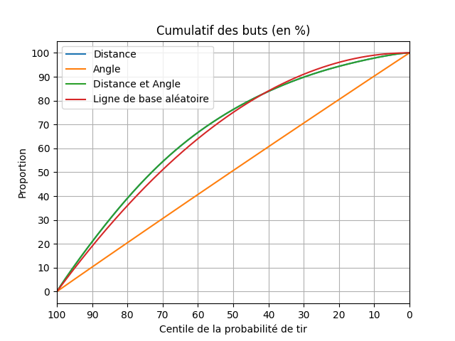
      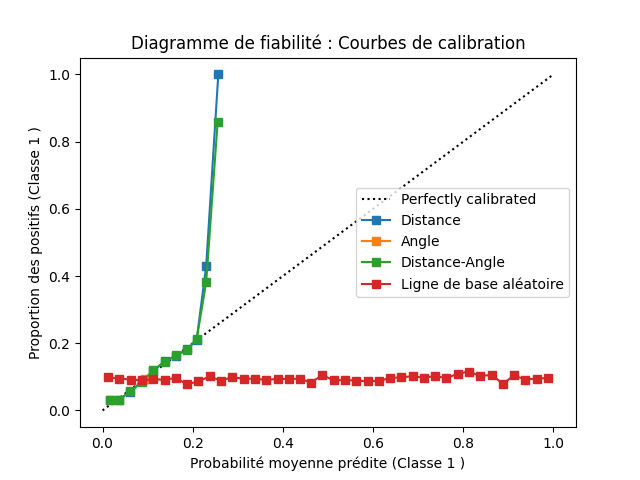
</p>

Les figures nous permettent d'observer que la courbe ROC du modèle basé uniquement sur la distance de tir se situe au-dessus du niveau de chance. L'angle de tir ne semble apporter aucune information pertinente pour prédire si un tir va résulter en un but ou non. En effet, les performances du modèle inclunat uniquement l'angle de tir oscillent autour de la change.Le modèle basé sur la distance et celui basé sur la distance et l'angle de tir ont des courbes qui se superposent, suggérant l'apport inexistant de la variable angle de tir sur la prédiction des buts espérés. De plus, dans le graphe de taux de buts en fonction des centiles on remarque bien que seulement les courbes des deux modèles ‘Distance’ et ‘Distance-Angle’ sont croissantes ce qui signifie que ces modèles sont capables de discerner entre les tirs ayant des probabilités de succès différentes, et que des probabilités de tir plus élevées sont associées à des taux de buts plus élevés. Cependant, la valeur maximale de ~0.22 au centile 100% indique qu'il y a toujours une incertitude même pour les tirs les plus prometteurs. Tandis que la courbe du modèle ‘Angle’ n’éloigne pas beaucoup de la ligne de base aléatoire ce qui montre que ce modèle ne fait que des prédictions aléatoires.

Le code pour produire les graphiques demandés se trouve dans le script [`Plots.py`](https://github.com/mathieupelo/ift6758-A08/blob/main/scripts/Plots.py). Ce code a été réutilisé dans les sections suivantes.

## Ingénierie des caractéristiques II

Ci-dessous se trouve la liste des caractéristiques créées:

- `prd`: indique la période du match (1, 2, 3, prolongation, tirs au but)
- `is_goal`: indique si le tir a résulté en un but
- `shotCategory`: catégorie ou type de tir effectué
- `coord_x`: coordonnée horizontale de l'action sur la glace
- `coord_y`: coordonnée verticale de l'action sur la glace
- `empty_net`: Indique si le but était vide lors du tir
- `last_event_type`: type de la dernière action enregistrée
- `last_event_x`: coordonnée horizontale de la dernière action
- `last_event_y`: coordonnée verticale de la dernière action
- `time_since_last_event`: temps écoulé depuis la dernière action (en secondes)
- `distance_from_last_event`: distance parcourue depuis la dernière action
- `game_seconds`: temps total écoulé dans le match (en secondes)
- `shot_distance`: distance du tir par rapport au but
- `shot_angle`: angle du tir par rapport au but
- `rebond`: indique si le tir était un rebond d'un tir précédent
- `changement_angle_tir`: changement d'angle entre ce tir et le tir précédent
- `vitesse`: vitesse du tir (distance depuis l'évènement précédent / temps depuis l'évènement précédent)
- `power_play_time_elapsed`: temps écoulé depuis le jeu de puissance (secondes)
- `home_team_skater_count`: nombre de joueurs présents sur la glace de l'équipe hôte (sans le gardien de but)
- `away_team_skater_count`: nombre de joueurs présents sur la glace de l'équipe visiteur (sans le gardien de but)

Le code utilisé pour générer le nouveau DataFrame se trouve dans le script [`feature_engineering.py`](https://github.com/mathieupelo/ift6758-A08/blob/main/scripts/feature_engineering.py). Il est possible d'accéder à l'artefact Dataframe via le [lien vers l'expérience Comet](https://www.comet.com/me-pic/milestone-2/0ead41c0bc834bf1a776452bbb08792f).

Les modèles présentés dans les sections suivantes ont tous été entraînés sur les données prétraitées de DataFrame.

> **Prétraitement des caractéristiques:**
> <br>La variable *prdTime* a été enlevée puisqu'elle est redondante avec les variables *prd* et *game_seconds* qui ont été incluses dans l'ensemble de caractéristiques. Ensuite, les variables *shotCategory* et *last_event_type* catégorielles ont été encodées avec la technique de *Hot-One-Encoding* selon l'implémentation de la librairie pandas (voir [get_dummies](https://pandas.
pydata.org/docs/reference/api/pandas.get_dummies.html)). Les variables continues *coord_x*, *coord_y*, *last_event_x*, *last_event_y*, *time_since_last_event*, *distance_from_last_event*, *game_seconds*, 
*shot_distance*, *shot_angle*, *changement_angle_tir*, *vitesse*, *power_play_time_elapsed*, *home_team_skater_count* et *away_team_skater_count* ont été standardisées grâce à la fonction [StandardScaler](https://scikit-learn.org/stable/modules/generated/sklearn.preprocessing.StandardScaler.html) de scikit-learn. Un encodage binaire a été effectué sur les variables *empty_net* et *rebond* grâce à la fonction [LabelEncoder](https://scikit-learn.org/stable/modules/generated/sklearn.preprocessing.LabelEncoder.html) de scikit-learn. La variable cible *goalFlag* a également été binarisée. Le prétraitement des données est réalisé par la fonction `preprocessing` se trouvant dans le script [feature_engineering.py](https://github.com/mathieupelo/ift6758-A08/blob/main/scripts/feature_engineering.py).

## Modèles avancés

### Question 1

Dans cette section nous avons testé un modèle XGBoost avec les valeurs par défaut des hyperparamètres. Le modèle a été entraîné sur les caractéristiques d'angle et de distance entre le tir et le filet en incluant 80% des observations des données d'entraînement. Le modèle a été évalué sur les 20% restant. La performance et le comportement du modèle peut être visualisé ci-dessous. Ce modèle perfome moins bien que la modèle de régression logistique présenté dans la section précédente qui incluait les mêmes caractéristiques. En effet, ici on obtient un score ROC de 0.4973.

<p align="center">
      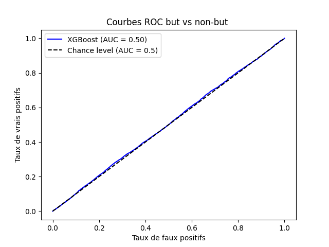
      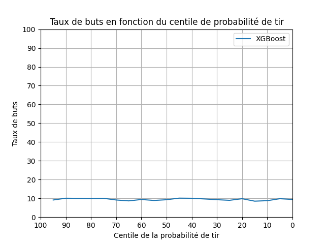
</p>
<p align="center">
      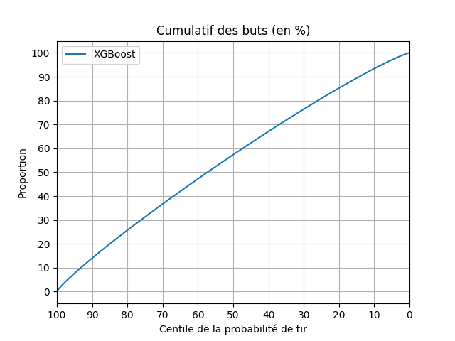
      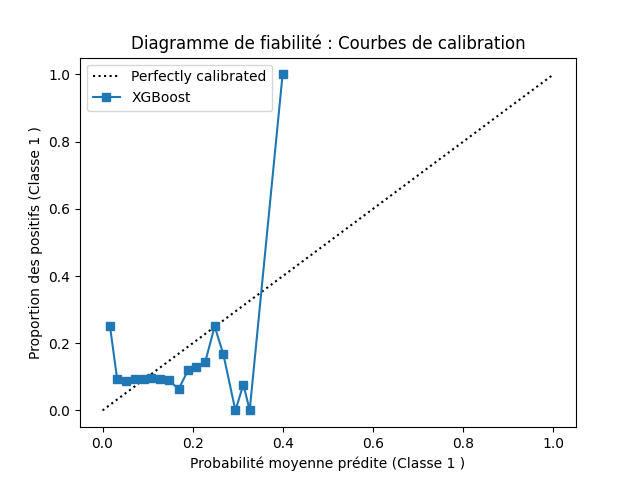
</p>

Le lien vers l'expérience Comet se trouve [ici](https://www.comet.com/me-pic/milestone-2/e8cc0480d75a433a9f70eb77a4584fed).

### Question 2

L'optimisation d'hyperparamètres a été effectué en utilisant une approche de recherche par grille (i.e., [*GridSearch*](https://scikit-learn.org/stable/modules/generated/sklearn.model_selection.GridSearchCV.html)). Pour ce modèle, nous avons considéré les trois hyperparamètres ci-dessous, puisqu'ils ont un énorme impact sur la performance du modèle XGBoost. C'est également une pratique commune d'optimiser ces 3 hyperparamètres: 

- `n_estimator`: nombre total d'arbres 
- `max_depth`: profondeur maximale de chaque arbre
- `learning_rate`: taux d'apprentissage utilisé pour mettre à jour la contribution des nouveaux arbres au modèle

La grille de recherche pour ces paramètres a été définie avec les valeurs suivantes:
- `n_estimator`: [50, 100, 200]
- `max_depth`: [3, 5, 7]
- `learning_rate`: [0.01, 0.1, 0.2]

Pour la validation-croisée, un Kfold avec k=5 a été effectué, ce qui signifie que 135 (3x3x3x5) combinaisons possibles d'hyperparamètres ont été testées. La meilleure solution a été trouvée avec les valeurs suivantes:
- `n_estimators` = 200
- `max_depth` = 5
- `learning_rate` = 0.1

Le nouveau modèle entraîné avec les meilleurs hyperparamètres a permis d'obtenir de meilleures performances que le modèle précédent. En effet, avec ce modèle, nous obtenons un score ROC de 0.7972. Il pourrait également être intéressant de tester une autre méthode d'optimisation d'hyperparamètres comme l'hypercube latin aléatoire. Cette dernière permet de couvrir de manière plus efficace la distribution d'hyperparamètres. Il serait également possible de considérer d'autres hyperparamètres à optimiser tels que le nombre maximum de feuille (`max_leaves`), le terme de régularisation (p.ex. `reg_alpha`), le poids minimal de l'enfant (`min_child_weight`), etc. Le lien comet pour cette expérience se trouve [ici](https://www.comet.com/me-pic/milestone-2/c54943f96d8443a3bb628b5e4eccf149) (modèle [xgboostbest v1.1.0](https://www.comet.com/me-pic/model-registry/xgboostbest)).

<p align="center">
      
      
</p>
<p align="center">
      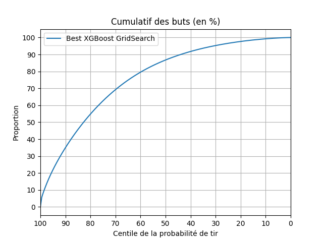
      
</p>

TODO: Insérer figure pour justifier le choix des hyperparamètres

Finalement, nous avons procéder à la sélection de caractéristiques en prenant compte des meilleures valeurs d'hyperparamètre. Pour ce faire, nous avons ressorti tous les scores qui dépassaient un seuil du 60e percentile. Treize caractéristiques ont donc été sélectionnées pour développer un nouveau modèle (le lien vers l'expérience Comet se trouve [ici](https://www.comet.com/me-pic/milestone-2/265d5cd995d94abe89e79bfeec39a8f9); modèle [xgboost v1.8.0](https://www.comet.com/me-pic/model-registry/xgboost)). Nous avons observé que l'entraînement de ce modèle était plus rapide, mais le score ROC a diminué légèrement (score ROC = 0.7884). Le meilleur modèle pour le XGBoost est donc celui qui contient toutes les caractéristiques et qui est entraîner après avoir fait la recherche d'hyperparamètres (score ROC = 0.7972).

<p align="center">
      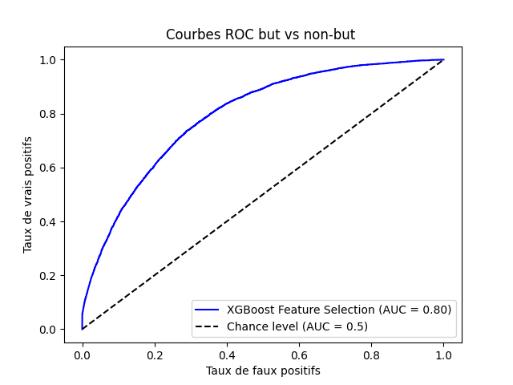
      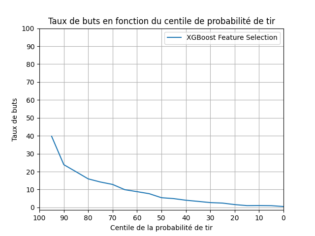
</p>
<p align="center">
      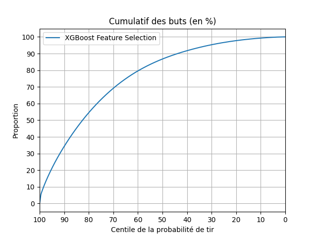
      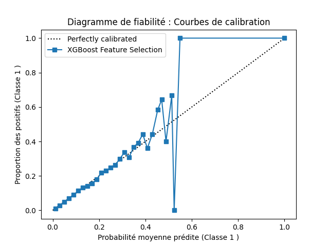
</p>

TODO: Discuter stratégies de sélection de features

TODO: Insérer des figures pour justifier le choix

## Faites de votre mieux !

Pour cette partie, nous avons tester trois différents modèles pour prédire les buts espérés: Forêt aléatoire (RandomForest), Histogram-based Gradient Boost Classification Tree, Boosted Logistic Régression. Les particularités de chaque modèle sont décrites ci-dessous:

### Algorithmes de classification

**Forêt aléatoire (Random Forest)**

L'algorithme de forêt aléatoire a été inclus dans les modèles testés en raison de son efficacité démontrée sur les données tabulaires ([Grinztajn et al., 2022](https://
proceedings.neurips.cc/paper_files/paper/2022/file/0378c7692da36807bdec87ab043cdadc-Paper-Datasets_and_Benchmarks.pdf)). Notre modèle est basé sur l'implétation [RandomForestClassifier](https://scikit-learn.org/stable/modules/generated/sklearn.ensemble.RandomForestClassifier.html) de scikit-learn. Les données ont été séparées en ensembles d'entraînement et de validation (80% et 20% des observations dans chaque ensemble, respectivement). Une procédure d'optimisation des hyperparamètres par recherche aléatatioire ([RandomizedSearchCV](https://scikit-learn.org/stable/modules/generated/sklearn.model_selection.RandomizedSearchCV.html) a été effectuée sur l'ensemble d'entraînement sur les hyperparamètres suivants: `n_estimators` ([100, 200, 300]), `max_depth` ([10, 20, 30]) et `min_samples_split` ([2, 5, 10]). Le lien vers l'expérience comet se trouve [ici](https://www.comet.com/me-pic/milestone-2/c13d013f22324f82b7da9d05395b2850) ([modèle random_forest](https://www.comet.com/me-pic/model-registry/random_forest)).

**Histogram-based Gradient Boost Classification Tree**
Le choix de cet algorithme est basé sur l'article de ([Grinztajn et al., 2022](https://proceedings.neurips.cc/paper_files/paper/2022/file/0378c7692da36807bdec87ab043cdadc-Paper-Datasets_and_Benchmarks.pdf)) montrant l'efficacité de ce type de modèle pour prédire des données tabulaires contenant des caractéristiques continues et discrètes, bien que les performances rapportées ne dépassaient pas celles de XGBoost. L'implémentation de scikit-learn ([HistGradientBoostingClassifier](https://scikit-learn.org/stable/modules/generated/sklearn.ensemble.HistGradientBoostingClassifier.html)) a été utilisé pour développer ce modèle. 

L'entraînement du modèle a été effectué sur 80% des données d'entraînement et l'évaluation a été faite sur le 20% restant. Une recherche aléatoire ([RandomizedSearchCV](https://scikit-learn.org/stable/modules/generated/sklearn.model_selection.RandomizedSearchCV.html)) a été performée sur les paramètres suivants: `learning_rate`, `max_iter` et `max_depth`. La précision balancée (*balanced accuracy*) a été utilisée comme méthode de scoring pour tenir compte de la nature débalancée de notre problème de classification. Le lien vers l'expérience comet se trouve [ici](https://www.comet.com/me-pic/milestone-2/ed9db8e4e48e47f983deda0ba37eda9e) ([modèle histgradientboosting v1.3.0](https://www.comet.com/me-pic/model-registry/histgradientboosting)).

**Régression Logistique amélioré**

Le modèle construit ici repose sur une approche de régularisation ElasticNet, qui combine à la fois les pénalités L1 et L2 pour gérer les caractéristiques redondantes ou non pertinentes, tout en assurant la stabilité du modèle. Pour optimiser ce processus, le solveur "saga" est utilisé, car il prend en charge spécifiquement la régularisation ElasticNet. L'utilisation de la régression logistique comme estimateur de base dans le cadre du boosting avec XGBoost est une caractéristique distinctive de ce modèle. Contrairement à l'utilisation traditionnelle d'arbres de décision, la régression logistique offre une approche linéaire qui peut être améliorée de manière incrémentielle à chaque itération du boosting.

Le choix de XGBoost comme algorithme de boosting confère au modèle la capacité de gérer des ensembles de données complexes et volumineux tout en améliorant la précision prédictive. La fonction de perte logistique est utilisée pour optimiser les performances du modèle dans le contexte d'une classification binaire. Pour évaluer et ajuster la performance du modèle, une stratégie de validation croisée aléatoire est adoptée. Cela garantit une évaluation robuste en découpant les données en plusieurs ensembles d'entraînement et de validation de manière aléatoire, atténuant ainsi les biais potentiels liés à une partition spécifique des données. Le lien vers l'expérience comet se trouve [ici](https://www.comet.com/me-pic/milestone-2/dd42f2fc37754ab0b9382aa604d736ea) ([modèle boosted_logistic_reg v1.0.0](https://www.comet.com/me-pic/model-registry/boosted_logistic_reg)).

### Performance des modèles

TODO: Discuter des différentes techniques utilisées
TODO: Insérer les 4 figures

**Comparaisons des modèles**

## Évaluer sur l'ensemble de test

### Question 1

<p align="center">
      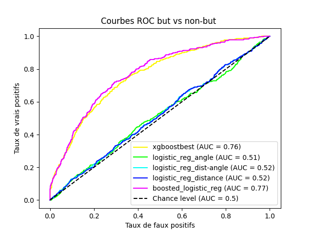
      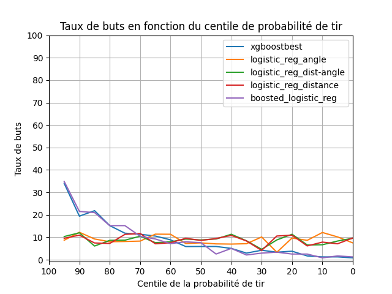
</p>
<p align="center">
      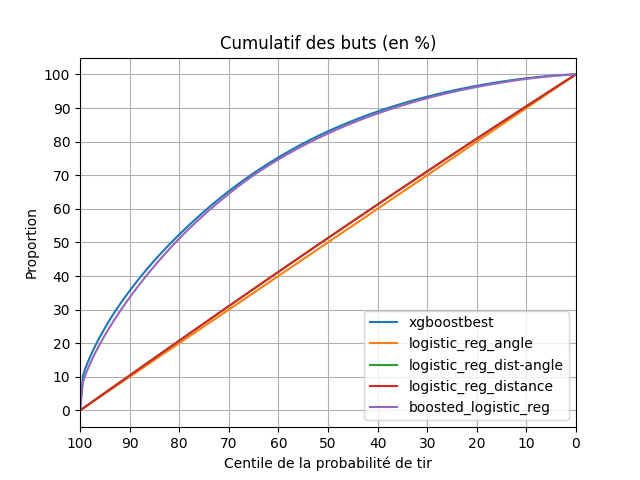
      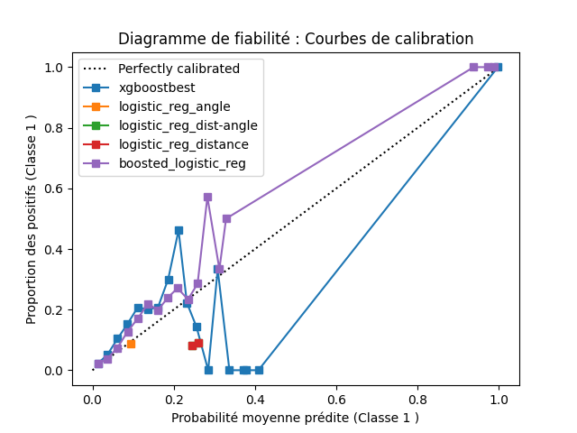
</p>

TODO: Discuter la performance des modèles

### Question 2

TODO: Insérer les 4 figures
TODO: Discuter la performance des modèles