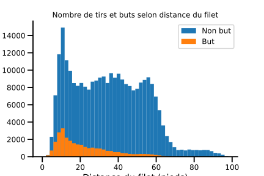
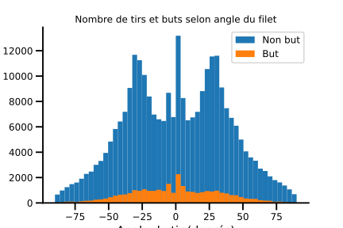
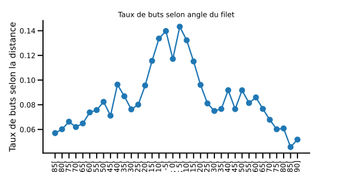
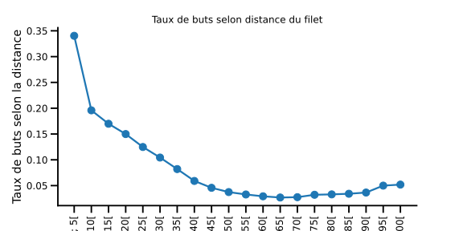
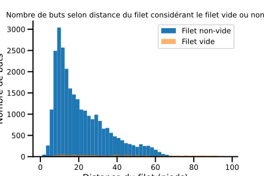
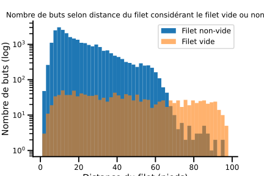

## Résumé

La deuxième partie de ce projet s'est concentrée sur l'ingénierie des caractéristiques (*feature engineering*) et le développement de modèles permettant de prédire les buts espérés (*expected Goals*; xG).

## Aperçu des données

Cette section fournie une description des données qui ont été utilisés dans cette étape du projet.

Les données utilisées proviennent de l'API de la LNH. Les données jeu-par-jeu (*play-by-play*) des saisons 2016-2017 à 2020-2021 inclusivement. Plus précisément, les données des saisons régulières de 2016-2017 jusqu'à 2019-2020 inclusivement ont été utilisées pour entraîner et valider les modèles développés. Toutes les données de la saison 2020-2021 ont été utilisées pour tester les modèles.

## Ingénérie des caractéristiques I

### Question 1

TODO: Insérer histogramme du nombre de tirs regroupées par distance

TODO: Insérer histogramme du nombre de tirs regroupées par angle

TODO: Insérer histogramme 2D incluant la distance et l'angle (sans séparer buts et non-buts)

NB: Étiquetter les axes et bien choisir l'échelle de l'axe

### Question 2

TODO: Insérer figure montrant la relation entre le taux de but et la distance, et entre la taux de but et l'angle du tir.

### Question 3

TODO: Insérer histogramme buts uniques par distance selon filet vide vs non-vide

## Modèles de base

### Question 1

TODO: Évaluer la précision du modèle

### Question 2

TODO: Insérer les 4 figures (ROC curve, taux de buts, proportion cumulée de buts, diagramme de fiabilité)

### Question 3

TODO: Insérer les 4 figures
TODO: Discuter de l'interprétaiton

### Question 4

TODO: Insérer liens vers comet.ml des 3 modèles

## Ingénierie des caractéristiques II

TODO: Ajouter liste des toutes les caractéristiques créées
TODO: Ajouter la description des caractéristiques
TODO: Insérer lien comet.ml

## Modèles avancés

### Question 1

TODO: Insérer les 4 figures
TODO: discuter de la configuration train/validation
TODO: Insérer lien vers comet.ml

### Question 2

TODO: Discuter de la configuration du réglage des hyperparamètres
TODO: Insérer figure pour justifier le choix des hyperparamètres
TODO: Insérer les 4 figures
TODO: Insérer lien comet.ml

### Question 3

TODO: Discuter stratégies de sélection de features
TODO: Insérer des figures pour justifier le choix
TODO: Insérer les 4 figiures
TODO: Insérer le lien comet.ml

## Faites de votre mieux !

## Question 1

TODO: Discuter des différentes techniques utilisées
TODO: Insérer les 4 figures

## Évaluer sur l'ensemble de test

### Question 1

TODO: Insérer les 4 figures.
TODO: Discuter la performance des modèles

### Question 2

TODO: Insérer les 4 figures
TODO: Discuter la performance des modèles