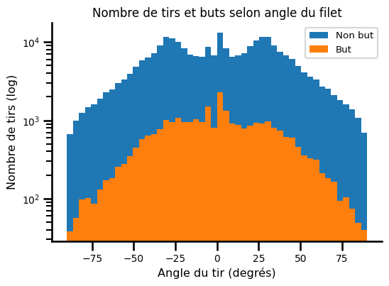

## Résumé

La deuxième partie de ce projet s'est concentrée sur l'ingénierie des caractéristiques (*feature engineering*) et le développement de modèles permettant de prédire les buts espérés (*expected Goals*; xG).

## Aperçu des données

Cette section fournie une description des données qui ont été utilisés dans cette étape du projet.

Les données utilisées proviennent de l'API de la LNH. Les données jeu-par-jeu (*play-by-play*) des saisons 2016-2017 à 2020-2021 inclusivement. Plus précisément, les données des saisons régulières de 2016-2017 jusqu'à 2019-2020 inclusivement ont été utilisées pour entraîner et valider les modèles développés. Toutes les données de la saison 2020-2021 ont été utilisées pour tester les modèles.

## Ingénérie des caractéristiques I

Les figures de la section ci-dessous peuvent être générées en roulant les cellules de la section Milestone 2 dans le notebook [visualisation.ipynb](https://github.com/mathieupelo/ift6758-A08/blob/main/notebooks/visualisation.ipynb). Cette section explore le nombre de tirs (buts vs non-buts) en fonction de la distance et l'angle entre le tireur et le filet. Pour calculer ces variables, nous avons pris en compte le point milieu du filet, soit les coordonnées absolues (89, 0).

La distance euclédienne entre le tir et le filet a été calculée comme suit:

```math
distance = \sqrt(xfilet - xtir)^2 + (yfilet - ytir)^2
```

L'angle entre le tir et le filet a été calculé comme suit:

### Question 1

Visuellement, nous pouvons observer que le nombre de tirs selon la distance ne semble pas être distribué normalement, autant pour les buts que les non-buts (voir Figure ci-dessous; gauche: données non-transformées, droite: données log transformées). En effet, la majorité des tirs (buts et non-buts) sont effectués à environ 10 pieds du filet. Au-delà de 10 pieds, le nombre de non-buts diminue et reste relativement stable entre 20 et 60 pieds pour diminuer de manière drastique au-delà de 60 pieds du filet. Le nombre de buts semble diminué de manière constante entre 20 et 60 pieds. au-delà de 60 pieds, le nombre de buts semble suivre la même tendance que le nombre de non-buts. Nous pouvons également conclure qu'il y a beaucoup moins de buts que de non-buts.

<p align="center">
      
      
</p>

Le nombre de tirs selon l'angle n'est pas distribué normalement, autant pour les buts que les non-buts. Nous pouvons observer que la distribution des non-buts semble être tri-modale, avec un pic à environ -30 degrés, un pic à 0 degré et un pic à environ 30 degré. La distribution de part et d'autres du zéro semble assez symétrique, ce qui suggère que nous pourrions considérer la valeur absolue des angles. En d'autres mots, que le tireur soit à gauche ou à droite du gradien ne semble pas avoir d'incidence sur le nombre de tirs ainsi que sur le nombre de buts. La distribution des buts ressemble un peu plus à une distribution normale, bien qu'il y a une prévalence qu'il y a un nombre de buts plus important lorsque l'angle entre le tireur et le filet est proche de 0.

<p align="center">
      
      
</p>

Nous pouvons tirer les mêmes conclusions globales que précédemment en regardant l'histogramme 2D ci-dessous. Par contre, il est à noter que les tirs ne sont pas séparés en buts et  non-buts dans cette figure.


### Question 2

TODO: Insérer figure montrant la relation entre le taux de but et la distance, et entre la taux de but et l'angle du tir.

<p align="center">
    
    
</p>

### Question 3

Nous pouvons observer qu'il y a un plus grand nombre de buts marqués aux alentours de 10 pieds lorsque le filet n'est pas vide. Lorsque la distance entre le tir et le filet dépasse les 10 pieds, le nombre de buts marqués diminue presque exponentiellement en fonction de la distance. Lorsque le filet est vide, le nombre de buts ne semble pas dépendre de la distance entre le tir et le filet.

<p align="center">
      
      
</p>


## Modèles de base

### Question 1

TODO: Évaluer la précision du modèle

### Question 2

TODO: Insérer les 4 figures (ROC curve, taux de buts, proportion cumulée de buts, diagramme de fiabilité)

### Question 3

TODO: Insérer les 4 figures
TODO: Discuter de l'interprétaiton

### Question 4

TODO: Insérer liens vers comet.ml des 3 modèles

## Ingénierie des caractéristiques II

TODO: Ajouter liste des toutes les caractéristiques créées
TODO: Ajouter la description des caractéristiques
TODO: Insérer lien comet.ml

## Modèles avancés

### Question 1

TODO: Insérer les 4 figures
TODO: discuter de la configuration train/validation
TODO: Insérer lien vers comet.ml

### Question 2

TODO: Discuter de la configuration du réglage des hyperparamètres
TODO: Insérer figure pour justifier le choix des hyperparamètres
TODO: Insérer les 4 figures
TODO: Insérer lien comet.ml

### Question 3

TODO: Discuter stratégies de sélection de features
TODO: Insérer des figures pour justifier le choix
TODO: Insérer les 4 figiures
TODO: Insérer le lien comet.ml

## Faites de votre mieux !

## Question 1

TODO: Discuter des différentes techniques utilisées
TODO: Insérer les 4 figures

## Évaluer sur l'ensemble de test

### Question 1

TODO: Insérer les 4 figures.
TODO: Discuter la performance des modèles

### Question 2

TODO: Insérer les 4 figures
TODO: Discuter la performance des modèles